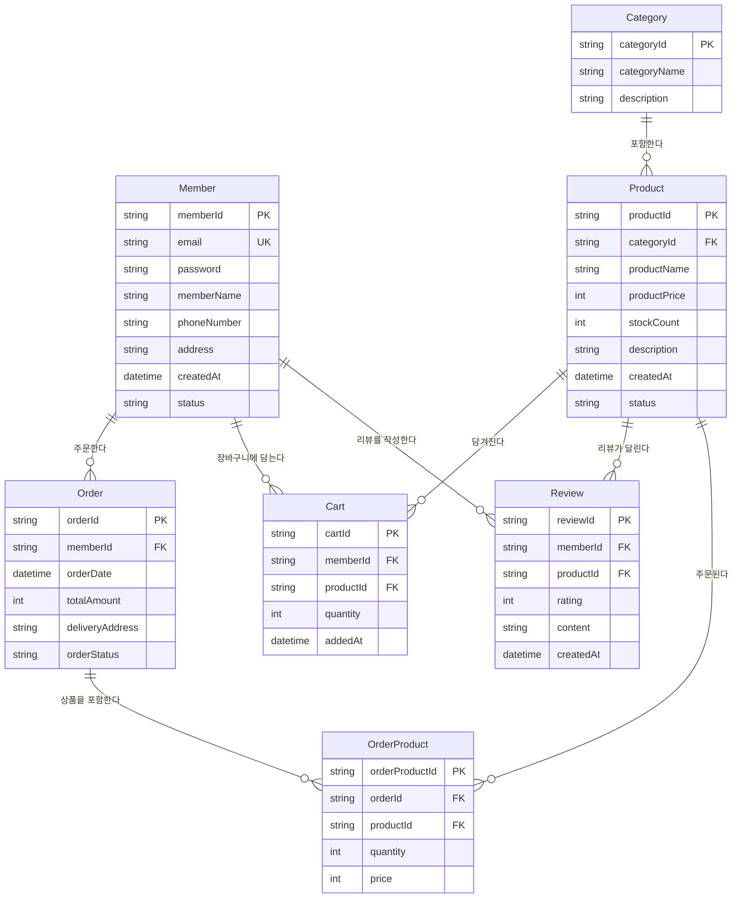

# 🎯 ERD(Entity-Relationship Diagram) 설계 완벽 가이드

> **🤔 왜 이 가이드를 만들었나?**
> 
> Java Spring 백엔드 프로젝트를 진행하면서 ERD 작성 방법을 이해하지 못하고, ERD 작성 순서와 무엇을 기준 삼아서 설계해야 하는지 명확한 원칙과 패턴을 알지 못해 정리한 실전 가이드입니다.

## 🎯 학습 목표

**데이터베이스 설계의 핵심인 ERD 작성 방법과 원칙, 그리고 체계적인 작성 순서를 완벽히 마스터하자!**

---

## 📋 목차

1. [ERD란 무엇인가?](#-erd란-무엇인가)
2. [ERD 작성 기준과 출발점](#-erd-작성-기준과-출발점)
3. [ERD 작성 4단계 프로세스](#-erd-작성-4단계-프로세스)
4. [ERD 작성 핵심 원칙](#-erd-작성-핵심-원칙)
5. [실전 ERD 작성 예시](#-실전-erd-작성-예시)
6. [ERD 검토 체크리스트](#-erd-검토-체크리스트)

---

## 🎨 ERD란 무엇인가?

### 💡 정의: **"데이터베이스 구조를 시각화한 설계도"**

ERD는 시스템에서 다루는 **데이터의 종류(Entity)**, **데이터가 갖는 속성(Attribute)**, 그리고 **데이터 간의 연관성(Relationship)** 을 그림으로 표현한 데이터베이스 설계도입니다.

### 🎯 ERD의 핵심 목적

- **데이터 구조 시각화**: 복잡한 데이터 관계를 한눈에 파악
- **설계 검증**: 데이터베이스 구축 전 구조적 문제점 미리 발견
- **팀 커뮤니케이션**: 개발팀과 기획팀 간의 명확한 소통 도구
- **개발 가이드**: 실제 테이블 설계와 JPA Entity 작성의 기준점

---

## 🔍 ERD 작성 기준과 출발점

### 📊 핵심 기준: **"서비스의 핵심 기능과 비즈니스 요구사항"**

ERD는 만들고자 하는 **서비스의 핵심 기능과 요구사항**을 기준으로 작성해야 합니다.

### 💭 기준점 찾기 질문들

1. **"이 애플리케이션은 무엇을 해야 하는가?"**
2. **"사용자는 어떤 데이터를 생성, 조회, 수정, 삭제하는가?"**
3. **"비즈니스 규칙은 무엇인가?"** (예: 한 명의 회원은 여러 주문 가능)
4. **"데이터 간의 제약사항은 무엇인가?"** (예: 주문에는 반드시 회원이 필요)

### 🎯 요구사항 분석 예시: 온라인 쇼핑몰

```
핵심 기능:
- 회원가입/로그인
- 상품 조회/검색
- 장바구니 담기
- 주문/결제
- 주문내역 조회

➜ 필요한 주요 데이터: 회원, 상품, 장바구니, 주문, 주문상품
```

---

## 🔄 ERD 작성 4단계 프로세스

### 1️⃣ **엔티티(Entity) 도출** - 핵심 명사 찾기

#### 🎯 작업 내용
시스템의 핵심 **'명사'**들을 찾아내어 엔티티로 정의합니다.

#### 💡 도출 방법
- 요구사항에서 **명사** 추출
- **독립적으로 존재**할 수 있는 객체인지 확인
- **여러 개의 인스턴스**를 가질 수 있는지 확인

#### 📝 예시: 온라인 쇼핑몰
```
추출된 명사: 회원, 상품, 카테고리, 주문, 장바구니, 리뷰, 쿠폰

엔티티 후보:
✅ Member (회원)
✅ Product (상품) 
✅ Category (카테고리)
✅ Order (주문)
✅ Cart (장바구니)
✅ Review (리뷰)
✅ Coupon (쿠폰)
```

---

### 2️⃣ **속성(Attribute) 정의** - 각 엔티티의 정보 나열

#### 🎯 작업 내용
각 엔티티가 가져야 할 **속성(컬럼)**들을 정의하고 **기본 키(PK)**를 지정합니다.

#### 💡 속성 정의 원칙
- **기본 키(PK)**: 각 레코드를 유일하게 식별
- **필수 속성**: 비즈니스 로직상 반드시 필요한 정보
- **선택 속성**: 있으면 좋지만 필수가 아닌 정보

#### 📝 예시: 주요 엔티티별 속성
```
Member (회원)
├── memberId (PK) - 회원 고유 ID
├── email - 이메일 (유니크)
├── password - 비밀번호
├── memberName - 회원명
├── phoneNumber - 전화번호
├── address - 주소
├── createdAt - 가입일시
└── status - 회원상태

Product (상품)
├── productId (PK) - 상품 고유 ID
├── productName - 상품명
├── productPrice - 상품가격
├── stockCount - 재고수량
├── description - 상품설명
├── categoryId (FK) - 카테고리 ID
├── createdAt - 등록일시
└── status - 상품상태

Order (주문)
├── orderId (PK) - 주문 고유 ID
├── memberId (FK) - 회원 ID
├── orderDate - 주문일시
├── totalAmount - 총 주문금액
├── deliveryAddress - 배송주소
└── orderStatus - 주문상태
```

---

### 3️⃣ **관계(Relationship) 설정** - 엔티티 간 연결고리 정의

#### 🎯 작업 내용
엔티티 간의 관계(1:1, 1:N, N:M)를 정의하고 **외래 키(FK)**를 설정합니다.

#### 📊 관계 유형별 특징

| 관계 유형 | 설명 | 예시 | 구현 방법 |
|----------|------|------|-----------|
| **1:1** | 일대일 관계 | 회원 ↔ 회원상세정보 | 어느 쪽이든 FK 보유 |
| **1:N** | 일대다 관계 | 회원 ↔ 주문 (한 회원이 여러 주문) | N쪽에 FK 보유 |
| **N:M** | 다대다 관계 | 상품 ↔ 주문 (한 주문에 여러 상품) | 중간 테이블 생성 |

#### 📝 예시: 관계 설정
```
주요 관계:
1. Member 1:N Order (한 회원이 여러 주문 가능)
2. Category 1:N Product (한 카테고리에 여러 상품)
3. Member 1:N Cart (한 회원이 여러 장바구니 아이템)
4. Order N:M Product (한 주문에 여러 상품, 한 상품이 여러 주문)
   ➜ OrderProduct 중간 테이블 생성
```

---

### 4️⃣ **검토 및 정규화** - 구조 최적화

#### 🎯 작업 내용
데이터 중복을 제거하고 일관성을 보장하는 **정규화** 과정을 통해 ERD를 완성합니다.

#### 📋 정규화 체크포인트
- **중복 데이터 제거**: 같은 정보가 여러 곳에 저장되지 않도록
- **참조 무결성**: FK 관계가 올바르게 설정되었는지
- **데이터 일관성**: 업데이트 시 모순이 발생하지 않는지

---

## 🎨 ERD 작성 핵심 원칙

### 💡 1. 정규화 (Normalization)
**"각 데이터는 제자리에, 단 한 번만 저장한다"**

```
❌ 잘못된 예시:
Order 테이블에 memberName, memberEmail 직접 저장

✅ 올바른 예시:
Order 테이블에 memberId(FK)만 저장, 회원 정보는 Member 테이블 참조
```

### 🏷️ 2. 명확한 이름 규칙
**일관된 네이밍 컨벤션 적용**

```
엔티티명: 단수 명사 (Member, Product, Order)
속성명: camelCase (memberId, productName, createdAt)
기본키: 엔티티명 + Id (memberId, productId, orderId)
외래키: 참조엔티티명 + Id (memberId, categoryId)
```

### 🔑 3. 기본 키(PK) 정의
**모든 엔티티는 유일한 식별자 필수**

```
권장사항:
- 의미 없는 대리키 사용 (UUID, Auto Increment)
- 복합키보다는 단일 컬럼 기본키
- 변하지 않는 값으로 설정
```

### 🔗 4. 관계의 명확성
**다대다(N:M) 관계는 중간 테이블로 해결**

```
N:M 관계 해결 패턴:
Order ←→ Product (다대다)
    ↓
Order 1:N OrderProduct N:1 Product (일대다 × 2)
```

---

## 🚀 실전 ERD 작성 예시

### 📁 온라인 쇼핑몰 ERD 구조



---

## ✅ ERD 검토 체크리스트

### 📝 엔티티 검토
- [ ] 모든 엔티티가 **독립적으로 존재** 가능한가?
- [ ] 엔티티명이 **단수 명사**로 명확하게 작명되었는가?
- [ ] 비즈니스 요구사항을 **모두 충족**하는가?

### 🔑 속성 검토
- [ ] 모든 엔티티에 **기본 키(PK)** 가 정의되었는가?
- [ ] 속성명이 **의미를 명확히** 전달하는가?
- [ ] **필수 속성**과 **선택 속성**이 적절히 구분되었는가?
- [ ] **데이터 타입**이 적절히 선택되었는가?

### 🔗 관계 검토
- [ ] 모든 관계의 **카디널리티**(1:1, 1:N, N:M)가 올바른가?
- [ ] **외래 키(FK)** 가 적절한 위치에 배치되었는가?
- [ ] **N:M 관계**가 중간 테이블로 정규화되었는가?
- [ ] **참조 무결성** 제약조건이 고려되었는가?

### 🎯 정규화 검토
- [ ] **중복 데이터**가 제거되었는가?
- [ ] **갱신 이상**, **삽입 이상**, **삭제 이상**이 없는가?
- [ ] 비즈니스 규칙이 ERD에 **올바르게 반영**되었는가?

### 🏷️ 네이밍 검토
- [ ] 전체적으로 **일관된 네이밍 규칙**이 적용되었는가?
- [ ] 약어 사용이 **최소화**되었는가?
- [ ] **예약어**와 충돌하지 않는가?

---

## 💡 핵심 정리

> 🎯 **ERD 설계의 핵심**
> 
> 1. **비즈니스 요구사항에서 출발**: 서비스가 해야 할 일을 명확히 파악
> 2. **체계적인 4단계 프로세스**: 엔티티 → 속성 → 관계 → 정규화
> 3. **정규화를 통한 데이터 무결성**: 중복 제거와 일관성 보장
> 4. **명확하고 일관된 네이밍**: 팀 전체가 이해할 수 있는 명명 규칙

이제 Java Spring 백엔드 프로젝트에서 체계적이고 효율적인 ERD를 설계할 수 있을 거예요! 🚀

---

*이 가이드가 도움이 되었다면, 다음에는 JPA Entity 매핑과 연관관계 설정법도 정리해보겠습니다! 👋*
