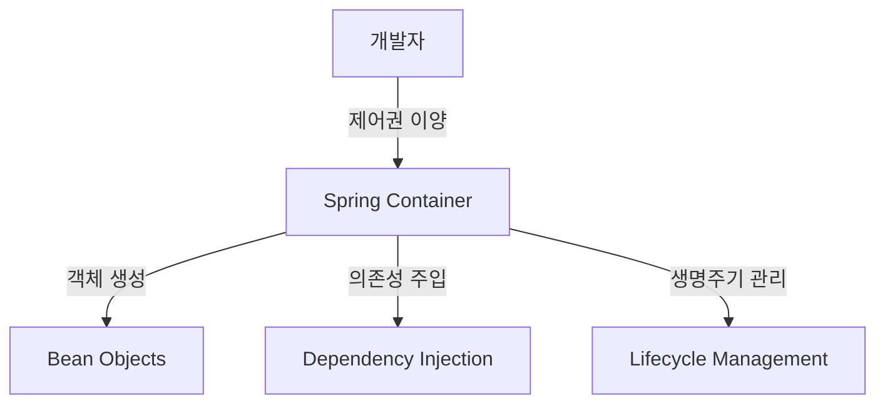

# 🏛️[SpringBoot] 스프링 부트의 핵심 개념: 제어의 역전(IoC) - XML 기반 구현

## 📖 개요

**제어의 역전(IoC, Inversion of Control)** 은 객체의 생성과 의존성 관리를 개발자가 아닌 **Spring Container** 가 담당하도록 하는 설계 원칙입니다. XML 설정 파일을 통해 IoC를 구현하는 전통적인 방법을 학습해보겠습니다.

---

## 🚨 기존 의존성 주입의 한계점

### 여전히 남은 문제점
이전에 의존성 주입을 통해 클래스 간 결합도를 낮췄지만, **여전히 수정이 필요한 부분**이 있습니다:

```java
public class Main {
    public static void main(String[] args) {
        CoffeeMaker coffeeMaker = new CoffeeMaker();
        
        // 🚨 새로운 커피 머신이 추가될 때마다 이 부분을 수정해야 함
        coffeeMaker.setCoffeeMachine(new DripCoffeeMachine());
        coffeeMaker.makeCoffee();
        
        // 다른 커피 머신으로 변경하려면 또 수정 필요
        coffeeMaker.setCoffeeMachine(new EspressoMachine());
        coffeeMaker.makeCoffee();
    }
}
```

### 복잡한 의존성 관계에서의 문제점
```java
// 실제 애플리케이션에서는 이런 복잡한 의존성 관계가 발생
UserService userService = new UserService();
PaymentService paymentService = new PaymentService();
EmailService emailService = new EmailService();
OrderService orderService = new OrderService();

// 의존성 주입
userService.setUserRepository(new UserRepository());
paymentService.setPaymentGateway(new StripePaymentGateway());
emailService.setEmailProvider(new GmailProvider());
orderService.setUserService(userService);
orderService.setPaymentService(paymentService);
orderService.setEmailService(emailService);

// 🚨 매번 이런 복잡한 설정 코드를 작성해야 함
```

---

## 🔄 제어의 역전(IoC) 개념

### 전통적 방식 vs IoC 방식

| 구분 | 전통적 방식 | IoC 방식 |
|------|-------------|----------|
| **객체 생성** | 개발자가 `new` 키워드로 직접 생성 | 프레임워크가 자동 생성 |
| **의존성 주입** | 개발자가 메서드 호출로 직접 주입 | 프레임워크가 자동 주입 |
| **흐름 제어** | 개발자가 직접 제어 | 프레임워크가 간접 제어 |
| **설정 방법** | 소스코드 내부에서 하드코딩 | 외부 설정 파일 또는 애노테이션 |

### IoC의 핵심 아이디어


---

## 📄 XML 기반 IoC 구현

### 1단계: XML 스키마 준비

Spring Framework의 공식 XML 스키마를 사용합니다:
- **참조 링크**: [Spring XML Schemas](https://docs.spring.io/spring-framework/reference/core/appendix/xsd-schemas.html)

### 2단계: beans.xml 파일 생성

**파일 위치**: `src/main/resources/beans.xml`

```xml
<?xml version="1.0" encoding="UTF-8"?>
<beans xmlns="http://www.springframework.org/schema/beans"
       xmlns:xsi="http://www.w3.org/2001/XMLSchema-instance"
       xsi:schemaLocation="http://www.springframework.org/schema/beans
       https://www.springframework.org/schema/beans/spring-beans.xsd">

    <!-- 드립 커피 머신 Bean 정의 -->
    <bean id="dripCoffeeMachine" class="com.example.demo.DripCoffeeMachine"/>
    
    <!-- 에스프레소 머신 Bean 정의 -->
    <bean id="espressoMachine" class="com.example.demo.EspressoMachine"/>
    
    <!-- 커피 메이커 Bean 정의 및 의존성 주입 -->
    <bean id="coffeeMaker" class="com.example.demo.CoffeeMaker" init-method="makeCoffee">
        <property name="coffeeMachine" ref="espressoMachine"/>
    </bean>
    
</beans>
```

### 3단계: 클래스 구조 정의

#### 인터페이스
```java
public interface CoffeeMachine {
    String brew();
}
```

#### 구현체들
```java
public class EspressoMachine implements CoffeeMachine {
    @Override
    public String brew() {
        return "Brewing coffee with Espresso Machine";
    }
}

public class DripCoffeeMachine implements CoffeeMachine {
    @Override
    public String brew() {
        return "Brewing coffee with Drip Coffee Machine";
    }
}
```

#### CoffeeMaker 클래스
```java
public class CoffeeMaker {
    private CoffeeMachine coffeeMachine;
    
    // Setter 메서드 (XML에서 property 주입을 위해 필요)
    public void setCoffeeMachine(CoffeeMachine coffeeMachine) {
        this.coffeeMachine = coffeeMachine;
    }
    
    // init-method로 지정될 메서드
    public void makeCoffee() {
        System.out.println(coffeeMachine.brew());
    }
}
```

### 4단계: Spring Boot 애플리케이션 설정

```java
@SpringBootApplication
@ImportResource("classpath:beans.xml")  // XML 설정 파일 import
public class DemoApplication {
    public static void main(String[] args) {
        SpringApplication.run(DemoApplication.class, args);
    }
}
```

---

## 🧩 XML 설정 파일 구성 요소

### &lt;bean&gt; 태그 속성들

| 속성 | 설명 | 예시 |
|------|------|------|
| **id** | Bean의 고유 식별자 | `id="coffeeMaker"` |
| **class** | Bean으로 생성할 클래스 (전체 패키지 경로) | `class="com.example.demo.CoffeeMaker"` |
| **init-method** | 객체 생성 후 자동 실행할 메서드 | `init-method="makeCoffee"` |
| **destroy-method** | 객체 소멸 전 실행할 메서드 | `destroy-method="cleanup"` |

### &lt;property&gt; 태그 - 의존성 주입

```xml
<!-- Setter 주입 -->
<bean id="coffeeMaker" class="com.example.demo.CoffeeMaker">
    <property name="coffeeMachine" ref="espressoMachine"/>
    <property name="maxCapacity" value="500"/>
</bean>

<!-- 생성자 주입 -->
<bean id="coffeeMaker" class="com.example.demo.CoffeeMaker">
    <constructor-arg ref="espressoMachine"/>
    <constructor-arg value="500"/>
</bean>
```

---

## 🚀 실행 흐름 분석

### 1. 애플리케이션 시작
```java
SpringApplication.run(DemoApplication.class, args);
```

### 2. XML 파일 로딩
```java
@ImportResource("classpath:beans.xml")
```

### 3. Spring Container의 작업 순서
1. **Bean 정의 파싱**: XML에서 Bean 정보를 읽어들임
2. **객체 생성**: 각 Bean 클래스의 인스턴스 생성
   ```java
   DripCoffeeMachine dripCoffeeMachine = new DripCoffeeMachine();
   EspressoMachine espressoMachine = new EspressoMachine();
   CoffeeMaker coffeeMaker = new CoffeeMaker();
   ```
3. **의존성 주입**: `<property>` 태그에 따라 의존성 주입
   ```java
   coffeeMaker.setCoffeeMachine(espressoMachine);
   ```
4. **초기화 메서드 실행**: `init-method` 실행
   ```java
   coffeeMaker.makeCoffee(); // 자동 실행
   ```

### 4. 실행 결과
```
Brewing coffee with Espresso Machine
```

---

## ✅ XML 기반 IoC의 장점

### 🎯 **코드 변경 없는 설정 변경**
```xml
<!-- 에스프레소 머신에서 드립 머신으로 변경하려면 XML만 수정 -->
<bean id="coffeeMaker" class="com.example.demo.CoffeeMaker" init-method="makeCoffee">
    <property name="coffeeMachine" ref="dripCoffeeMachine"/>  <!-- 여기만 변경! -->
</bean>
```

### 🏗️ **중앙집중식 설정 관리**
- 모든 Bean 설정을 한 곳에서 관리
- 의존성 관계를 한눈에 파악 가능
- 환경별 설정 분리 용이

### 🔧 **유연한 객체 생명주기 제어**
```xml
<bean id="databaseConnection" 
      class="com.example.DatabaseConnection"
      init-method="connect"
      destroy-method="disconnect"
      scope="singleton">
    <property name="url" value="jdbc:mysql://localhost:3306/mydb"/>
</bean>
```

---

## ⚠️ XML 기반 IoC의 한계점

### 1. **컴파일 타임 검증 불가**
```xml
<!-- 오타가 있어도 실행 시점에만 에러 발생 -->
<bean id="coffeeMaker" class="com.example.demo.CoffeeMakr">  <!-- 오타! -->
    <property name="coffeeMachin" ref="espressoMachine"/>    <!-- 오타! -->
</bean>
```

### 2. **IDE 지원 제한**
- 자동완성, 리팩토링 지원 부족
- 클래스명 변경 시 XML 파일 수동 수정 필요

### 3. **XML 파일 복잡성 증가**
대규모 프로젝트에서는 XML 파일이 매우 복잡해질 수 있습니다.

---

## 🆚 현대적 접근법과의 비교

### Annotation 기반 설정 (현재 권장 방식)
```java
@Component
public class EspressoMachine implements CoffeeMachine {
    // 구현
}

@Component
public class CoffeeMaker {
    private final CoffeeMachine coffeeMachine;
    
    @Autowired
    public CoffeeMaker(CoffeeMachine coffeeMachine) {
        this.coffeeMachine = coffeeMachine;
    }
    
    @PostConstruct
    public void makeCoffee() {
        System.out.println(coffeeMachine.brew());
    }
}
```

### Java Config 기반 설정
```java
@Configuration
public class CoffeeConfig {
    
    @Bean
    public CoffeeMachine espressoMachine() {
        return new EspressoMachine();
    }
    
    @Bean
    public CoffeeMaker coffeeMaker(CoffeeMachine coffeeMachine) {
        CoffeeMaker maker = new CoffeeMaker();
        maker.setCoffeeMachine(coffeeMachine);
        return maker;
    }
}
```

---

## 🎯 언제 XML 설정을 사용할까?

### 적합한 경우
- **레거시 시스템 통합**: 기존 XML 기반 설정과의 호환성 필요
- **외부 라이브러리 설정**: 소스 코드 수정이 불가능한 서드파티 라이브러리
- **런타임 설정 변경**: 애플리케이션 재배포 없이 설정 변경 필요

### 현재 권장 방식
- **Annotation 기반**: `@Component`, `@Service`, `@Repository`
- **Java Config**: `@Configuration`, `@Bean`
- **Spring Boot Auto Configuration**: `@SpringBootApplication`

---

## 💡 실무 팁

### XML과 Annotation 혼용
```java
@SpringBootApplication
@ImportResource("classpath:legacy-beans.xml")  // 레거시 XML 설정
public class ModernApplication {
    // 현대적 애노테이션 기반 코드
}
```

### Profile별 XML 설정
```xml
<!-- beans-dev.xml -->
<beans profile="dev">
    <bean id="dataSource" class="com.example.DevDataSource"/>
</beans>

<!-- beans-prod.xml -->
<beans profile="prod">  
    <bean id="dataSource" class="com.example.ProdDataSource"/>
</beans>
```

---

## 🎓 학습 포인트

### 핵심 개념
1. **제어의 역전**: 객체 생성과 관리 책임을 프레임워크에 위임
2. **외부 설정**: 코드 변경 없이 설정 파일만으로 동작 변경 가능
3. **생명주기 관리**: init-method, destroy-method를 통한 객체 생명주기 제어

### 다음 학습 단계
- **Annotation 기반 IoC**: `@Component`, `@Autowired` 등
- **Java Config**: `@Configuration`, `@Bean`
- **Spring Boot Auto Configuration**: 자동 설정의 원리
- **Bean Scope**: Singleton, Prototype, Request, Session

XML 기반 IoC는 Spring Framework의 기초를 이해하는 데 중요한 개념이지만, 현재는 더 간편하고 타입 안전한 **Annotation 기반 설정**을 주로 사용합니다.
