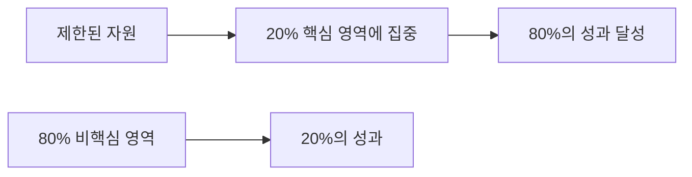

# 🏛️[Study Code] The 80-20 LEARNER

## 📖 파레토 법칙의 탄생

### 역사적 배경
**1941년**, 공학자이자 경영 컨설턴트인 **조지프 M. 주란(Joseph M. Juran)** 이 이탈리아 경제학자 **빌프레도 파레토(Vilfredo Pareto)** 의 발견에 주목했습니다.

#### 파레토의 관찰
> 🇮🇹 이탈리아 토지의 **80%**를 인구의 단 **20%**가 소유한다

#### 주란의 발전
파레토의 관찰을 확장하여 **삶의 거의 모든 영역**에서 이런 불평등한 분배 패턴이 나타난다고 주장했습니다.

---

## 🎯 80:20 법칙의 핵심 원리

### 기본 개념
> **모든 결과나 현상의 80%가 실제로는 20%의 원인에서 발생한다**

### 주란의 해석
- **핵심적인 소수 (Vital Few)**: 큰 영향을 미치는 20%
- **쓸 만한 다수 (Useful Many)**: 상대적으로 작은 영향을 미치는 80%

### 전략적 활용법


---

## 🌍 일상 속 80:20 법칙 사례

### 💼 비즈니스 영역
| 분야 | 80:20 분배 |
|------|------------|
| **매출** | 매출의 80%는 20%의 고객이 창출 |
| **고객서비스** | 고객 불만의 20%가 업무 시간의 80% 차지 |
| **소프트웨어** | 버그의 20%가 오류의 80%를 유발 |

### 🏥 사회/건강 영역
- **의료비**: 건강 관리 기금의 80%가 20%의 인구에 사용
- **운동**: 운동의 20%가 건강에 80%의 영향
- **식습관**: 몸에 좋은 음식 80% + 기호식품 20%의 균형

### 📱 개인 생활 영역
- **앱 사용**: 설치된 앱의 20%만 주로 사용
- **옷장**: 옷의 20%가 평소 착용의 80% 차지
- **인간관계**: 관계의 20%가 사회적 욕구의 80% 충족

### 🔧 문제 해결 영역
- **문제 분석**: 문제의 20%만 해결해도 80%가 개선
- **학습**: 핵심 개념 20%가 전체 이해의 80% 차지

---

## 📚 학습에 80:20 법칙 적용하기

### 🎯 효율적 학습 전략

#### 1. **핵심 개념 파악**
```
전체 학습 내용 중 20%의 핵심 개념을 먼저 마스터
→ 전체 이해도의 80% 달성
```

#### 2. **우선순위 기반 학습**
- ⭐ **High Impact**: 자주 사용되고 중요한 개념
- 📝 **Medium Impact**: 보완적 이해가 필요한 내용  
- 💡 **Low Impact**: 참고용 또는 고급 내용

#### 3. **반복 학습의 효율화**
```
핵심 20% 내용을 여러 번 반복 → 장기 기억 형성
나머지 80% 내용을 한 번씩 → 전체적 이해 보완
```

### 💻 프로그래밍 학습 예시

#### Java Backend 개발자의 경우
**핵심 20%**:
- 객체지향 프로그래밍 기본 원리
- Spring Framework 핵심 개념 (IoC, DI)
- 데이터베이스 연동 (JPA 기본)
- REST API 설계

**보완 80%**:
- 고급 디자인 패턴
- 성능 튜닝
- 다양한 라이브러리 활용
- 배포/운영 관련 기술

---

## ⚖️ 80:20 법칙의 올바른 사용

### ✅ 적용하기 좋은 상황

#### 📊 **데이터 기반 분석 가능한 경우**
- 학습 시간 대비 성과 측정 가능
- 명확한 우선순위 설정 가능
- 반복적인 패턴이 관찰되는 영역

#### 🎯 **목표가 명확한 경우**
- 구체적이고 측정 가능한 학습 목표
- 시간이나 자원의 제약이 있는 상황
- 효율성이 중요한 프로젝트

### ⚠️ 주의해야 할 상황

#### 🚫 **맹목적 적용 금지**
> **80:20 법칙은 1940년대 이래로 많은 사람이 오해했고, 오늘날에는 정당하지 않은 상황에도 막무가내로 적용되는 경우가 많다.**

#### 🤔 **신중한 판단이 필요한 경우**
- 창의성이 중요한 영역
- 기초가 중요한 학습 초기 단계
- 전체적 이해가 필수인 분야
- 안전이나 정확성이 중요한 영역

---

## 🛠️ 실전 적용 전략

### 1단계: 분석 (Analysis)
```
현재 학습하는 내용을 분석하여
- 어떤 20%가 가장 큰 영향을 미치는가?
- 어떤 부분에 시간을 가장 많이 쓰는가?
- 실제 업무나 목표와 직결되는 부분은?
```

### 2단계: 우선순위 설정 (Prioritization)
```
High Priority (20%) → Medium Priority (30%) → Low Priority (50%)
```

### 3단계: 집중 학습 (Focus)
```
핵심 20%에 전체 학습 시간의 80% 투자
나머지 80% 내용에 20% 시간 배분
```

### 4단계: 검증 및 조정 (Validation)
```
정기적으로 성과 측정
필요시 우선순위 재조정
지속적인 개선
```

---

## 📈 성공적인 80:20 학습자 되기

### 🎯 **핵심 마인드셋**
- 완벽주의보다는 **효율성 추구**
- **전략적 사고**로 우선순위 설정
- **지속적인 개선**과 조정 의지

### 🔄 **반복 적용 과정**
1. **관찰**: 현재 학습 패턴 분석
2. **가설**: 어느 20%가 핵심인지 추정
3. **실험**: 집중 학습 실시
4. **측정**: 결과 분석
5. **개선**: 전략 수정 및 반복

### ⚡ **즉시 적용 가능한 팁**

#### 📅 **시간 관리**
```
하루 학습 시간의 80%를 핵심 주제 20%에 집중
나머지 20% 시간으로 전체적인 복습이나 탐색
```

#### 📝 **노트 정리**
```
핵심 개념 20%는 상세히 정리
나머지 80%는 키워드나 요약 위주로 정리
```

#### 🔍 **복습 전략**
```
핵심 내용은 매일 반복
보조 내용은 주/월 단위 복습
```

---

## 💡 마무리: 전략적 학습자 되기

80:20 법칙은 **만능 해결책이 아닌 하나의 도구**입니다. 중요한 것은:

> 🎯 **어떻게 적용할지**는 물론이고, **적용할지 여부**에 관해 신중하고 전략적으로 생각하는 것

### 성공 공식
```
올바른 20% 식별 + 집중된 노력 + 지속적 조정 = 효율적 학습 성과
```

**기억하세요**: 여러분의 학습 여정에서 **진짜 중요한 20%**를 찾아내는 것이 첫 번째 단계입니다! 

---

## 🔗 다음 단계

- 현재 학습 중인 분야에서 핵심 20% 식별하기
- 개인별 학습 패턴 분석하고 데이터 수집하기
- 80:20 원칙을 활용한 학습 계획 수립하기
- 정기적인 성과 측정 및 전략 조정하기
